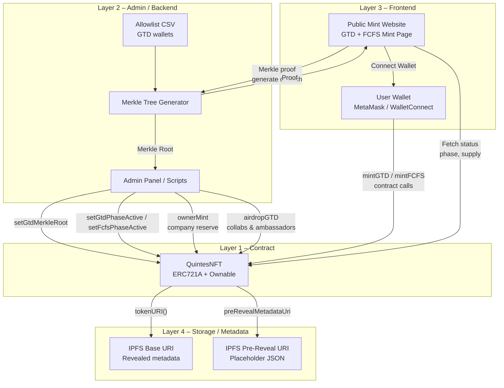

```mermaid
graph TD

%% Layers
subgraph L4[Layer 4 – Storage / Metadata]
  IPFSBase["IPFS Base URI\nRevealed metadata"]
  IPFSPre["IPFS Pre-Reveal URI\nPlaceholder JSON"]
end

subgraph L3[Layer 3 – Frontend]
  MintSite["Public Mint Website\nGTD + FCFS Mint Page"]
  Wallet["User Wallet\nMetaMask / WalletConnect"]
end

subgraph L2[Layer 2 – Admin / Backend]
  AdminPanel["Admin Panel / Scripts"]
  CSV["Allowlist CSV\nGTD wallets"]
  Merkle["Merkle Tree Generator"]
end

subgraph L1[Layer 1 – Contract]
  Contract["QuintesNFT\nERC721A + Ownable"]
end

%% Flows: Admin & Allowlist
CSV --> Merkle
Merkle -->|"Merkle Root"| AdminPanel
AdminPanel -->|"setGtdMerkleRoot"| Contract
AdminPanel -->|"setGtdPhaseActive / setFcfsPhaseActive"| Contract
AdminPanel -->|"ownerMint\ncompany reserve"| Contract
AdminPanel -->|"airdropGTD\ncollabs & ambassadors"| Contract

%% Flows: Frontend & Users
MintSite -->|"Connect Wallet"| Wallet
Wallet -->|"mintGTD / mintFCFS\ncontract calls"| Contract
MintSite -->|"Fetch status\nphase, supply"| Contract
MintSite -->|"Merkle proof\ngenerate or fetch"| Merkle
Merkle -->|"Proof"| MintSite

%% Flows: Metadata
Contract -->|"tokenURI()"| IPFSBase
Contract -->|"preRevealMetadataUri"| IPFSPre
```
